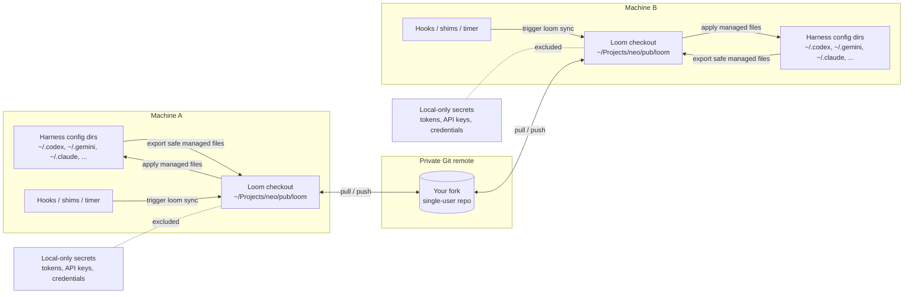
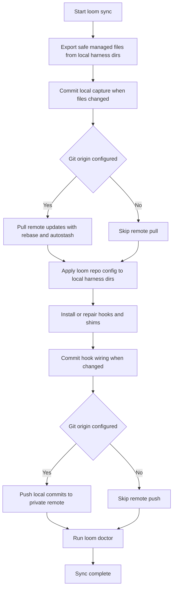
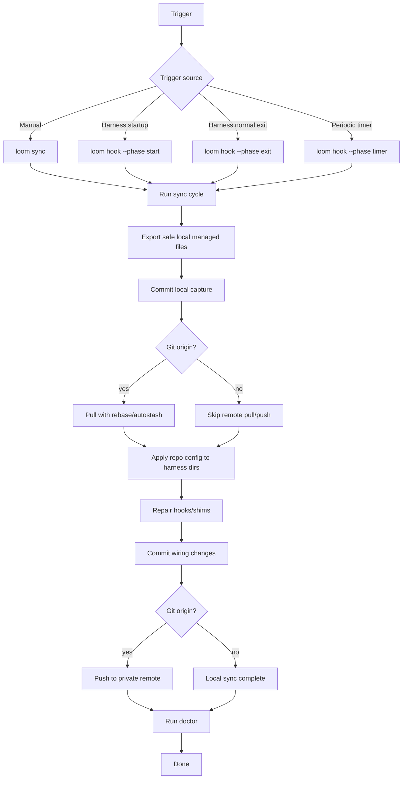

# loom

[中文说明](README.zh-CN.md)

`loom` is a small, personal configuration hub for synchronizing global AI-agent / coding-agent harness settings across your own machines.

It keeps a Git-backed copy of selected agent configuration files, installs startup / exit hooks where supported, adds command shims for common CLIs, and runs a periodic timer so local safe configuration changes can be pushed and pulled across machines.

## 1. Scope and warning

### 1.1 Single-user only

`loom` is designed for **one person syncing their own machines**.

It is **not** a team configuration-management system. Do not use one shared `loom` repository for multiple people unless you redesign the trust, conflict, and secret-handling model yourself.

Why single-user only:

- global agent prompts and hooks are highly personal and machine-specific
- different users may have different model providers, auth methods, red lines, memory files, and MCP servers
- hook scripts execute locally and should not be accepted from other people casually
- Git conflicts in global config files are much easier to reason about for one user than for a team

### 1.2 Fork before use

If you want to use this project, **fork it to your own account first**.

Recommended setup:

1. fork this repository
2. make the fork private if it contains your personal agent preferences
3. clone your fork on each machine
4. run `loom install` on each machine

Do not point your machines at someone else's live config repository.

### 1.3 Do not store secrets

`loom` is intended to sync configuration, prompts, skills, hooks, and similar text assets. It is not a secret manager.

The repository excludes common secret-bearing files such as:

- auth files
- API key files
- token files
- credential files
- OAuth files
- `.env` files
- session/history/cache databases

Still, you should review your fork before pushing it to any remote.

## 2. What loom syncs

`loom` syncs a curated set of global harness configuration files described in:

```text
config/manifest.json
```

Typical managed content includes:

- global prompts / memory files
- harness settings files that do not contain secrets
- skill directories
- persona files
- hook scripts
- markdown rule files

Typical local-only content includes:

- provider API keys
- auth tokens
- OAuth credentials
- local model/provider endpoints if sensitive
- runtime sessions, logs, caches, history, and databases

## 3. How synchronization works

`loom sync` performs a two-way Git-backed sync cycle. The key idea is that each machine keeps its own local harness directories, while the `loom` checkout acts as the portable Git-backed hub.

### 3.1 Architecture overview



### 3.2 `loom sync` sequence



### 3.3 Trigger flow



### 3.4 Step-by-step behavior

`loom sync` performs these concrete steps:

1. export safe local managed files into the loom repository
2. commit local changes if any
3. pull remote changes with rebase / autostash when a Git origin exists
4. apply repository config back to local harness directories
5. install or repair hooks and shims
6. commit hook wiring changes if any
7. push to remote when a Git origin exists
8. run `loom doctor`

If no Git remote is configured, local export/apply still works, but cross-machine sync will not happen.

## 4. Installation

### 4.1 Clone or fork

Use a persistent checkout. The default expected location is:

```text
~/Projects/neo/pub/loom
```

Example:

```bash
mkdir -p ~/Projects/neo/pub
cd ~/Projects/neo/pub
git clone <your-private-fork-url> loom
cd loom
```

### 4.2 Install on the current machine

Run:

```bash
./bin/loom install
```

After the first install, new shells should be able to run:

```bash
loom doctor
```

`loom install` performs the local machine setup:

1. installs the `loom` CLI into the user executable path, default `~/.local/bin/loom`
2. installs harness startup / exit hooks where configured
3. leaves real harness CLIs untouched; same-name command shims are disabled by default
4. installs a periodic timer
5. runs `loom doctor`

### 4.3 Configure the remote

For cross-machine sync, configure your private remote:

```bash
cd ~/Projects/neo/pub/loom
git remote add origin <your-private-fork-url>
git push -u origin main
```

On the next machine, clone the same fork and run:

```bash
loom install
loom sync
```

## 5. Automatic sync layers

`loom` uses multiple sync triggers because no single hook mechanism is reliable across every harness.

### 5.1 Harness hooks

For harnesses that support hooks, `loom` writes startup and exit sync hooks.

Examples of event types used by supported harnesses:

- `SessionStart`
- `Stop`
- `SessionEnd`

To keep harness startup fast, automatic hook/timer sync is throttled to at most once per local calendar day. After the first successful automatic sync of the day, later startup, exit, and timer hooks skip quickly. Manual `loom sync` always runs a full sync.

The daily throttle state is local runtime state stored under:

```text
state/last-auto-sync.json
```

This file is intentionally ignored by Git.

For Codex specifically, `Stop` hooks must return valid JSON on stdout. `loom` therefore installs a JSON-safe Codex Stop hook wrapper: sync logs are redirected to `logs/codex-stop-hook.log`, while stdout returns `{}`. This prevents Codex errors such as `hook returned invalid stop hook JSON output`.

Exact support depends on the harness.

### 5.2 Command shims

Same-name command shims are **disabled by default**. `loom` does not move or replace harness CLIs such as `codex`, `gemini`, `claude`, or `opencode`, and it should not put wrapper commands ahead of the real CLIs in `PATH`.

Automatic sync now relies on native harness hooks where available plus the periodic timer. If you need sync in the middle of a day, run:

```bash
loom sync
```

### 5.3 Periodic timer

`loom install-timer` installs a periodic sync timer.

Supported timer backends:

| OS | Backend |
| --- | --- |
| Linux | `systemd --user` timer |
| macOS | `launchd` LaunchAgent |
| Windows | Task Scheduler via `schtasks` |

The timer is a safety net for changes made while a harness is running or for abnormal exits where an exit hook may not run.

## 6. Common commands

```bash
loom install          # full local machine setup
loom doctor           # validate managed files and hook config
loom sync             # run full two-way sync now
loom export           # export safe local files into the repo
loom apply            # pull/apply repo files back to local harness dirs
loom install-cli      # install ~/.local/bin/loom
loom install-hooks    # install/repair harness hooks
loom install-shims    # currently a no-op; same-name shims are disabled by default
loom install-timer    # install/repair periodic timer
loom timer-status     # show timer status
```

Useful examples:

```bash
loom sync
loom timer-status --platform linux
loom install-timer --interval-minutes 5
loom install-cli --cli-mode symlink
```

## 7. Repository layout

```text
bin/loom                  # main CLI source
config/manifest.json      # managed file manifest and exclusions
agents/                   # per-harness synced configuration
shared/                   # shared personas/hooks/assets
shims/                    # optional shim workspace; not added to PATH by default
templates/                # templates such as Git hooks
logs/                     # local logs, ignored by Git
state/                    # local state, ignored by Git
```

## 8. Safety model

`loom` uses several layers to reduce accidental secret syncing:

- manifest-level local-only files
- exclude globs for token/auth/credential/cache/session files
- JSON sensitive-key checks during export
- Git ignore rules
- a pre-commit secret scanner template

This is best-effort protection, not a substitute for review.

Before pushing to a remote, inspect:

```bash
git status
git diff --cached
git grep -n -I -E 'token|api[_-]?key|secret|password|credential|oauth'
```

If a file contains secrets, remove it from `managed_files` and add it to `local_only_files` / `exclude_globs` in `config/manifest.json`.

## 9. Conflict handling

`loom` uses Git as the source of truth for cross-machine sync.

The normal flow uses:

```text
git pull --rebase --autostash
```

If two machines edit the same managed file differently, Git may require manual conflict resolution. Resolve the conflict in the loom repository, then run:

```bash
loom doctor
loom apply
loom sync
```

For best results, avoid editing the same global config on multiple machines at the same time.

## 10. Current assumptions

This repository currently reflects one user's harness ecosystem and paths. If you fork it, expect to customize:

- `config/manifest.json`
- harness-specific files under `agents/`
- hook definitions
- shims
- timer interval
- any global prompt/persona content

That customization is expected. Treat your fork as your personal agent-config home, not as a universal default.
