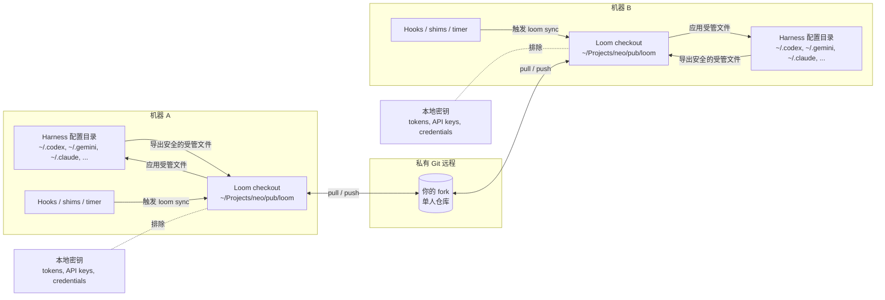
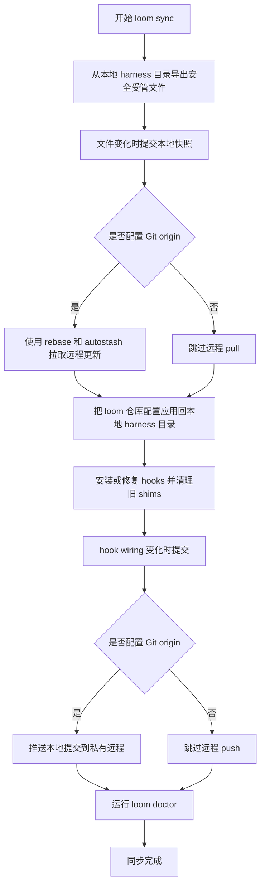
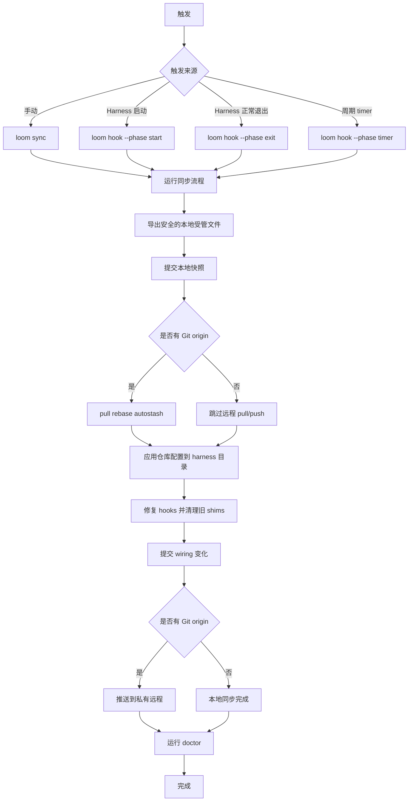

# loom

[English README](README.md)

`loom` 是一个面向个人使用的配置同步中心，用来在你自己的多台电脑之间同步全局 AI Agent / Coding Agent harness 配置。

它会把选定的 Agent 配置文件放进一个 Git 管理的 hub 仓库中，同时安装启动/退出 hooks、CLI shims 和周期性 timer，让安全的本地配置变更可以在多台机器之间同步。

## 1. 适用范围与重要提醒

### 1.1 仅供单人使用

`loom` 设计目标是：**一个人同步自己的多台电脑**。

它不是团队配置管理系统。除非你自己重新设计信任模型、冲突处理、权限边界和密钥管理，否则不要让多人共用同一个 `loom` 仓库。

为什么仅建议单人使用：

- 全局 Agent 提示词、hooks、红线/黄线/绿线往往非常个人化
- 不同用户可能使用不同模型服务商、认证方式、MCP、Skills、全局记忆
- hook 脚本会在本机执行，不应随意接受他人的 hook 配置
- Git 冲突在单人场景下可控，多人共用会明显复杂化

### 1.2 使用前请先 fork

如果你想使用这个项目，建议先 **fork 到你自己的账号下**。

推荐方式：

1. fork 这个仓库
2. 如果里面包含你的个人 Agent 偏好，建议把 fork 设置为 private
3. 在每台机器上 clone 你自己的 fork
4. 每台机器执行 `loom install`

不要把自己的机器指向别人的实时配置仓库。

### 1.3 不要存储密钥

`loom` 用来同步配置、提示词、Skills、hooks、规则文件等文本资产。它不是密钥管理器。

仓库会尽量排除常见敏感文件，例如：

- auth 文件
- API key 文件
- token 文件
- credential 文件
- OAuth 文件
- `.env` 文件
- session / history / cache / 数据库文件

但这只是防护层之一。推送远程前，你仍然应该自己 review 一遍。

## 2. loom 同步什么

`loom` 通过下面的 manifest 描述要管理的文件：

```text
config/manifest.json
```

通常会同步：

- 全局提示词 / 记忆文件
- 不含密钥的 harness settings
- skill 目录
- persona 文件
- hook 脚本
- markdown 规则文件

通常不会同步：

- 服务商 API key
- auth token
- OAuth credential
- 敏感的本地模型/服务商 endpoint
- runtime session、logs、cache、history、数据库

## 3. 同步机制

`loom sync` 执行的是一个基于 Git 的双向同步流程。核心思想是：每台机器保留自己的 harness 本地配置目录，而 `loom` checkout 作为可携带的 Git-backed hub。

### 3.1 架构总览



### 3.2 `loom sync` 流程



### 3.3 触发流程



### 3.4 具体步骤

`loom sync` 会执行：

1. 导出安全的本地受管文件到 loom 仓库
2. 如有变化则提交本地快照
3. 如果配置了 Git origin，则执行 pull rebase autostash
4. 把仓库中的配置应用回本地 harness 目录
5. 安装或修复 hooks，并清理旧 command shims
6. 如 hook wiring 有变化则提交
7. 如果配置了 Git origin，则 push 到远程
8. 运行 `loom doctor`

如果没有配置 Git 远程，loom 仍然可以做本地 export/apply，但不会跨机器同步。

## 4. 安装

### 4.1 Clone 或 fork

建议使用持久 checkout。默认推荐路径：

```text
~/Projects/neo/pub/loom
```

示例：

```bash
mkdir -p ~/Projects/neo/pub
cd ~/Projects/neo/pub
git clone <your-private-fork-url> loom
cd loom
```

### 4.2 在当前机器安装

运行：

```bash
./bin/loom install
```

安装后，新 shell 应该可以直接执行：

```bash
loom doctor
```

`loom install` 会：

1. 安装 `loom` CLI 到用户可执行路径，默认 `~/.local/bin/loom`
2. 安装 harness 启动/退出 hooks
3. 不接管真实 harness CLI；默认禁用同名 command shims
4. 安装周期性 timer
5. 运行 `loom doctor`

### 4.3 配置远程

跨机器同步需要配置你的私有远程：

```bash
cd ~/Projects/neo/pub/loom
git remote add origin <your-private-fork-url>
git push -u origin main
```

下一台机器 clone 同一个 fork 后执行：

```bash
loom install
loom sync
```

## 5. 自动同步层

`loom` 使用多层触发机制，因为不同 harness 的 hook 支持并不完全一致。

### 5.1 Harness hooks

对于支持 hooks 的 harness，`loom` 会写入启动和退出同步 hooks。

常见事件包括：

- `SessionStart`
- `Stop`
- `SessionEnd`

为了避免每次打开 harness 都很慢，自动 hook/timer 同步现在会按本地自然日节流：**每天最多成功自动同步一次**。当天第一次自动同步成功后，后续启动、退出、timer 触发都会快速跳过。手动执行 `loom sync` 永远会完整同步。

每日节流状态保存在本地 runtime 文件：

```text
state/last-auto-sync.json
```

这个文件不会进入 Git。

对于 Codex，`Stop` hook 的 stdout 必须是合法 JSON。`loom` 会安装 JSON-safe 的 Codex Stop hook wrapper：同步日志会写入：

```text
logs/codex-stop-hook.log
```

而 stdout 固定返回：

```json
{}
```

这可以避免 Codex 报错：

```text
hook returned invalid stop hook JSON output
```

具体事件支持取决于 harness 本身。

### 5.2 Command shims

同名 command shims 现在**默认禁用**。`loom` 不会移动或替换 `codex`、`gemini`、`claude`、`opencode` 等真实 harness CLI，也不应该把 wrapper 放到 `PATH` 前面去覆盖原始命令。

自动同步现在主要依赖 harness 原生 hooks 和周期 timer。如果当天中途需要立即同步，手动执行：

```bash
loom sync
```

迁移说明：旧版本曾经会在 `shims/` 下创建与真实 CLI 同名的 wrapper，并把该目录加入 shell `PATH`。当前版本的 `loom sync`、`loom apply`、`loom install` 和 `loom install-shims` 会自动删除这些旧 wrapper，并从 `~/.bashrc` / `~/.zshrc` 删除旧的 `loom shims` PATH block。其他机器如果今天已经自动同步过，可以手动运行一次 `loom sync`，或者等第二天首次自动同步时自动清理。

### 5.3 周期 timer

`loom install-timer` 会安装周期性同步 timer。

支持：

| OS | 后端 |
| --- | --- |
| Linux | `systemd --user` timer |
| macOS | `launchd` LaunchAgent |
| Windows | Task Scheduler via `schtasks` |

Timer 是兜底层，用于处理 harness 运行期间的配置变化，或异常退出导致 exit hook 没跑的场景。Timer 同样遵守“每天最多一次自动同步”的节流规则。

## 6. 常用命令

```bash
loom install          # 完整本机安装
loom doctor           # 校验受管文件和 hook 配置
loom sync             # 立即执行完整双向同步
loom export           # 导出安全本地文件到仓库
loom apply            # 从仓库应用配置到本地 harness 目录
loom install-cli      # 安装 ~/.local/bin/loom
loom install-hooks    # 安装/修复 harness hooks
loom install-shims    # 当前为 no-op；默认禁用同名 shims
loom install-timer    # 安装/修复周期 timer
loom timer-status     # 查看 timer 状态
```

示例：

```bash
loom sync
loom timer-status --platform linux
loom install-timer --interval-minutes 5
loom install-cli --cli-mode symlink
```

## 7. 仓库结构

```text
bin/loom                  # 主 CLI 源码
config/manifest.json      # 受管文件 manifest 和排除规则
agents/                   # 各 harness 的同步配置
shared/                   # 共享 personas/hooks/assets
shims/                    # 可选 shim 工作区；默认不加入 PATH
templates/                # Git hooks 等模板
logs/                     # 本地日志，Git 忽略
state/                    # 本地状态，Git 忽略
```

## 8. 安全模型

`loom` 通过多层规则减少误同步密钥的风险：

- manifest 中的 local-only 文件
- token/auth/credential/cache/session 排除规则
- JSON 敏感 key 检查
- `.gitignore`
- pre-commit secret scanner 模板

这只是 best-effort，不替代人工 review。

推送前建议检查：

```bash
git status
git diff --cached
git grep -n -I -E 'token|api[_-]?key|secret|password|credential|oauth'
```

如果某个文件含有密钥，请从 `managed_files` 中移除，并加入 `config/manifest.json` 的 `local_only_files` / `exclude_globs`。

## 9. 冲突处理

`loom` 使用 Git 作为跨机器同步的来源。

正常流程使用：

```text
git pull --rebase --autostash
```

如果两台机器同时修改同一个受管文件，可能需要手动解决 Git 冲突。解决后执行：

```bash
loom doctor
loom apply
loom sync
```

建议避免同时在多台机器上编辑同一份全局配置。

## 10. 当前假设

这个仓库反映的是一个用户自己的 harness 生态和路径。如果你 fork 使用，通常需要调整：

- `config/manifest.json`
- `agents/` 下的 harness 配置
- hook 定义
- shims
- timer 间隔
- 全局 prompt / persona 内容

这属于正常使用方式。请把你的 fork 当成自己的个人 Agent 配置仓库，而不是通用默认配置。
